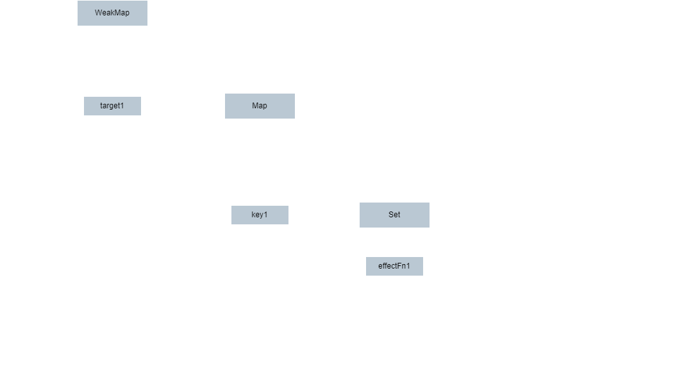

# V1

V1版本关键点在于依赖关系的建立，能够知道副作用函数依赖于哪些响应式数据对象的哪些属性。
`bucket -> target -> key -> dep`

- bucket: WeakMap, 用于存储{target -> key -> subscribers}结构
- target: Map，响应式数据对象
- key: string，被读取的target的属性名
- dep: Set，存储着与target.key相关的副作用函数，target.key修改后会重新执行这些副作用函数

> 这里的`dep`是依赖，可以理解为响应式数据更新后需要重新执行的函数
> 可以理解为 一系列 subscriber

在`get`的时候，能够知道是读取了对哪个对象的哪个属性。
这个时候会将当前副作用函数，存储到`bucket -> target -> key`结构中。

在`set`的时候，能够知道是修改了哪个对象的哪个属性。
这个时候需要重新执行那些读取了该属性值的effectFn。
通过`bucket -> target -> key`结构可以知道哪些effectFn需要重新执行。

